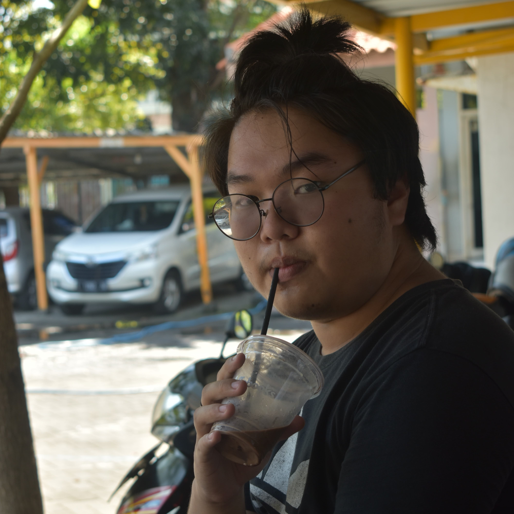

<!DOCTYPE html>
<html lang="en">
<head>
    <meta charset="UTF-8">
    <meta name="viewport" content="width=device-width, initial-scale=1.0">
    <title>My JJ Web</title>
    <link rel="stylesheet" href="https://cdnjs.cloudflare.com/ajax/libs/font-awesome/6.4.0/css/all.min.css">
    
</head>
<body>
    <header>
        <nav>
            <a href="#" class="logo">JJWEB</a>
            

                <a href="#home">Home</a>
                <a href="#about">About</a>
                <a href="#contact">Contact</a>
            

        </nav>
    </header>

    <section id="home">
        

            <h1>Halo Saya Jonathan</h1>
            
Passion saya ada di balik lensa kamera, kreativitas mengalir di meja editing, dan eksplorasi saya terus berkembang di dunia videografi. Inilah alchemy visual yang saya tawarkan.

            

                <a href="#about" class="btn btn-primary">Explore About Me</a>
                <a href="#contact" class="btn btn-outline">Contact Me</a>
            

        

        

            
        

    </section>

    <section id="about">
        

            <h2>About Me</h2>
        

        

            

                <h3>Professional Creative</h3>
                
Saya seorang profesional kreatif dengan spesialisasi utama di bidang fotografi yang telah saya kuasai hingga 90%. Didukung oleh keahlian editing gambar sebesar 70% dan kemampuan videografi sebesar 50%, saya menggabungkan ketiga elemen ini untuk menciptakan karya visual yang impactful.

                
                

                    <h3>My Talent</h3>
                    

                        

                            Photography
                            90%
                        

                        

                            

                        

                    

                    

                        

                            Editing
                            70%
                        

                        

                            

                        

                    

                    

                        

                            Videografer
                            50%
                        

                        

                            

                        

                    

                

            

        

    </section>

    <section id="contact">
        

            <h2>Get In Touch</h2>
        

        
Saya fokus menciptakan momen yang berbicara melalui frame

        
       
        

            <a href="https://www.instagram.com/jonathann171?igsh=MWRvcWthZ3ppbWQ1Zw==" target="_blank" class="social-card">
                
<i class="fab fa-instagram"></i>

                
Instagram

            </a>
            <a href="mailto:jonathanliuz172@gmail.com" class="social-card">
                
<i class="fas fa-envelope"></i>

                
Email

            </a>
        

    </section>

    <footer>
        

            <a href="#home">Home</a>
            <a href="#about">About</a>
            <a href="#contact">Contact</a>
            <a href="#">Privacy Policy</a>
        

        

            &copy; March 2025 [Jonathan]. All rights reserved.
        

    </footer>

    
</body>
</html>
